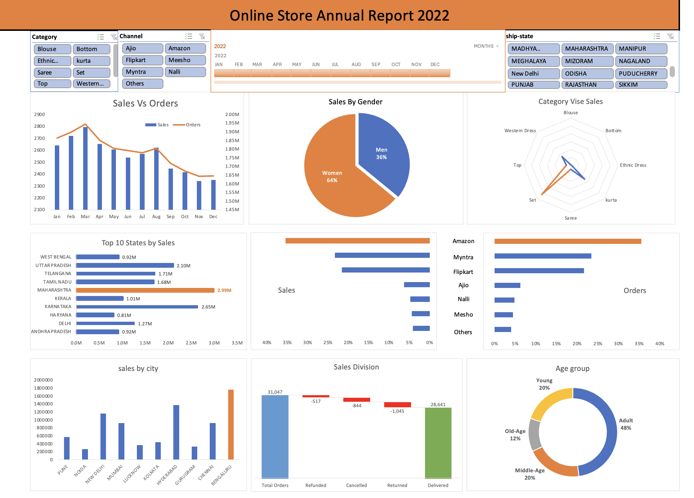

**Objective**
This Excel data analysis project aims to comprehensively evaluate the online store's 2023 annual sales data, uncovering crucial insights to drive strategic decision-making for 2024. By examining key performance indicators, customer demographics, and sales patterns, they seek to identify opportunities for offline expansion, optimize inventory management, and enhance customer retention. The analysis will focus on understanding regional preferences, seasonal trends, and the most profitable customer segments. These insights will inform targeted marketing strategies, guide product development, and support the store's overall growth objectives. Ultimately, this analysis will provide actionable recommendations to increase sales, improve operational efficiency, and strengthen the store's market position in the coming year.

**Overview**
This project showcases advanced Excel proficiency through comprehensive analysis of an online store's sales data. Utilizing complex formulas, pivot tables, and statistical functions, the analysis progresses from data cleaning to in-depth insights. The centerpiece is an interactive dashboard featuring dynamic charts and slicers, designed for non-technical users to easily explore sales trends, customer behavior, and key performance indicators. This user-friendly interface facilitates data-driven decision-making, demonstrating the ability to transform raw data into actionable business intelligence.

**Project structure is as follows:**
─ 01-Data Cleaning
─ 02-Data Processing
─ 03-Data Analysis
─ 04-Interactive Dashboard
─ 05-Insights
─ 06-Recomendations

**Dashboard Sample**

**Insights:**
Market Expansion Potential: Analysis reveals Bengaluru, Hyderabad, New Delhi, Pune, and Mumbai as prime locations for offline store expansion, based on their high order volumes, sales, and revenue contributions.

Operational Efficiency: The low rate of order issues (7.75% refunds/cancellations/returns) indicates strong operational performance and customer satisfaction, suggesting effective quality control and order fulfillment processes.

Seasonal Trends: March emerges as the peak sales month, providing crucial information for inventory management, marketing campaigns, and resource allocation throughout the year.

Target Demographic: Adults aged 26-44 are the primary sales drivers, with a notable emphasis on female customers in this age group.

Product Diversification: Accessories present a promising opportunity for market expansion and increased sales.

**Conclusion/Recommendations:**
Phased Offline Expansion: Prioritize opening physical stores in Bengaluru, Hyderabad, and New Delhi, followed by Pune and Mumbai. Conduct localized market research to tailor store offerings to regional preferences.

Seasonal Strategy: Develop a comprehensive March sales strategy, including increased inventory, targeted marketing campaigns, and special promotions to capitalize on the high-sales period.

Customer Segment Focus: Create personalized marketing campaigns for women aged 26-44, particularly in the identified high-performing cities. Utilize platforms like Amazon for targeted ads and promotions.

Product Line Expansion: Introduce a curated accessories line, timing the launch to coincide with the March sales peak. Consider city-specific accessories to appeal to local tastes.

Operational Excellence: While maintaining the current high standards in order fulfillment, implement a customer feedback system to further reduce the refund/cancellation/return rate.

Data-Driven Decision Making: Establish a regular data analysis cycle to continuously monitor performance, identify emerging trends, and adapt strategies accordingly.

Customer Retention: Develop a loyalty program targeting the core 26-44 age group to encourage repeat purchases and increase customer lifetime value.
